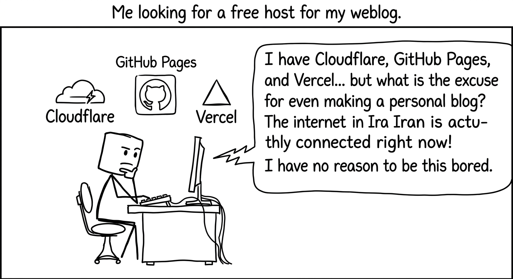
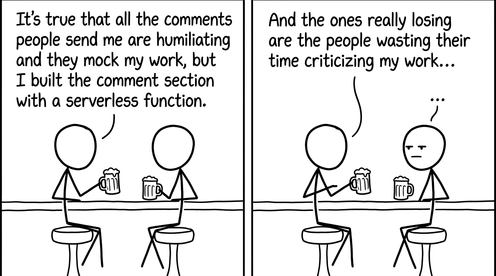

# vercel

 یک پلتفرم برای دپلوی پروژه های مختلف هست، میشه سایت های استاتیک رو روش قرار داد(رایگان) و یا serverless function ها رو روش قرار داد و من یک [ادیتور مارک دوون](https://rtlmarkdown.vercel.app/) که با جاوااسکریپت وانیلا ساخته شده رو داخلش قرار دادم!!
البته که پلتفرم های زیادی برای قرار دادن ابزار های استاتیک وجود داره مثل گیت هاب پیجز و cloudflare و ... وجود داره که رایگان هم هستن و فقط باید کد **html/css/js** رو داخلشون بزاری و خب چیز عجیب و غریبی نیستن!(کاش تو ایران هم همچین سرویسی می بود !! واقعا کم هزینه هست(حداقل برای شرکت هایی که این همه سرور دارن!!))

میخوام بیشتر درباره serverless function صحبت کنم !
بیاین به این مثال توجه کنید :
شما یک وبسایت استاتیک ساختید چون که نمی خواید هزینه یک هاست خیلی گرون رو بدید D: و به راحتی توی پلتفرم هایی که بالا گفتم و اون دوستمون توی تصویر داره بهشون فکر میکنه استفاده کنید، ولی این ابزار ها یک مشکلی دارن.....
***
بک اند ندارن... <:
***
قاعدتا خیلی از وبلاگ ها و خیلی از ابزار ها به بک اند خاصی نیاز ندارن و به راحتی سمت کلاینت اجرا میشن.

 ولی آیا برای پیاده سازی یک منطق ساده ، نیاز به بالا اومدن یک بک اند کامل هست !!!
فرض کنید یک فرم ارتباط با ما دارید
افراد میتونن نظراتشون رو بنویسن و با ایمیل شما ارسال بشه و یک منطق خیلی ساده ، مثلا جلوگیری از اسپم رو پیاده سازی کنه !
خب نیازی نیست که یک سرور کامل حتی با مشخصات خیلی کم بخریم ، صرفا به یک function نیاز داریم !
سرویس های مثلا کلادفلر و ورسل این قابلیت رو به ما میدن که یک serverless function داشته باشیم که همچین منطق ساده ای رو پیاده سازی کنه !

***
یا میتونیم ازش برای وبهوک استفاده کنیم ، مثلا بات تلگرام برای ارتباط با یوزر دو راه داره :
۱-polling
2-webhook
در روش اول ربات همش داره چک میکنه که درخواستی ارسال شده یا نه !!(منطقی به نظر نمیاد نه ؟)
در روش دوم منتظر وایمیسه که یک چیزی به اسم webhook بهش خبر بده که فلانی درخواست ارسال کرده و درخواستش چی بوده

در روش اول سخت افزار 24 ساعته باید فال گوش وایسته و هی پرس و جو کنه در روش دوم صرفا از یک serverless function مفتکی استفاده کردیم و سخت افزار ما هر وقت درخواستش بیاد اون رو پردازش میکنه.
حتی خود بات تلگرامم میشه داخلش قرار داد(هر چند که فکر میکنم خیلی کار سختی باشه شاید یک روز در قالب یک پروژه انجامش دادم)
