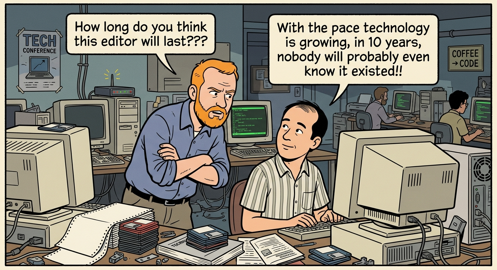

# vim , اختراع قدیمی و محبوب

مدتی پیش برای تقریبا چند هفته از vim مرتب استفاده میکردم، مشکلی که برام پیش اومد این بود که بعد از مدتی که می خواستم برم توی وی اس کد به شدت ناوبریش(حرکت به بالا و پایین و چپ و راست) من رو اذیت میکرد، vim به شدت ناوبری و ادیت خیلی قوی داره،جوری طراحی شده که سرعت کدنویسی رو به انتها  میرسونه(البته به جز کدنوسی با ایجنت !!)

تصمیم گرفتم که vim و vscode رو با هم ترکیب کنم پس به سراغ بخش جستجو افزونه های وی اس کد رفتم !! و افزونه vim رو نصب کردم ، واقعا در نوع خودش جالب بود،به جز اینکه بعضی شورت کات های وی اس کد مثل 
>ctrl + A      //selectAll
---
>ctrl + c     // copy

رو مختل کرده بود که اون هم از بخش تنظیمات شورت کات ها قابل تنظیم هست!
شاید بعدا ترکیب emcas و vim رو هم امتحان کردم (ناور بری vim داخل محیط توسعه emcas)
هر چند که چند دهه پیش بین طرفداران این دو ادیتور درگیری شدیدی وجود داشت.بعیدم نیست الانم وجود داشته باشه ولی ترکیب این دو تا باید جالب باشه!
